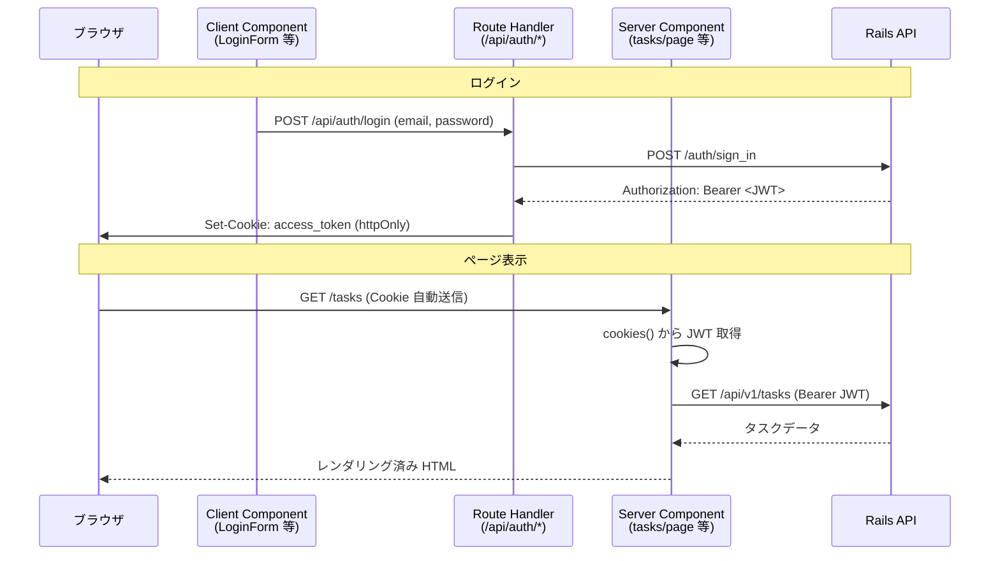

## 認証・認可について

### 認証の流れ

1. `/login` でメール・パスワードを送信
2. `POST /api/auth/login`（Next.js Route Handler）が Rails の `POST /auth/sign_in` を呼ぶ
3. 返却された JWT を **httpOnly Cookie**（`access_token`）に保存
4. 以降、Server Component が Cookie からトークンを読み、Rails API をサーバー側で呼び出す
5. ログアウト時は `DELETE /api/auth/logout` 経由で Rails の `sign_out` を呼び、Cookie を削除
6. API 側は Devise JWT で認証、CanCanCan で認可する

#### 全体の流れ（シーケンス図）

JWT はブラウザの JavaScript から読めない httpOnly Cookie に保存し、業務 API の呼び出しは Server Component がサーバー側で行う構成です。

### 認可（フロントエンド側）

- `GET /api/v1/profile` で権限を取得
- 画面遷移時、権限が無ければ `/forbidden` にリダイレクト
- タスクの「新規作成」、「編集」、「削除」リンクは権限に応じて出し分け

### ロールと権限（CanCanCan）

| role     | 権限            |
| -------- | ------------- |
| `normal` | `Task` の CRUD |
| `admin`  | すべてのリソースを管理   |
| `viewer` | `Task` の閲覧のみ  |
