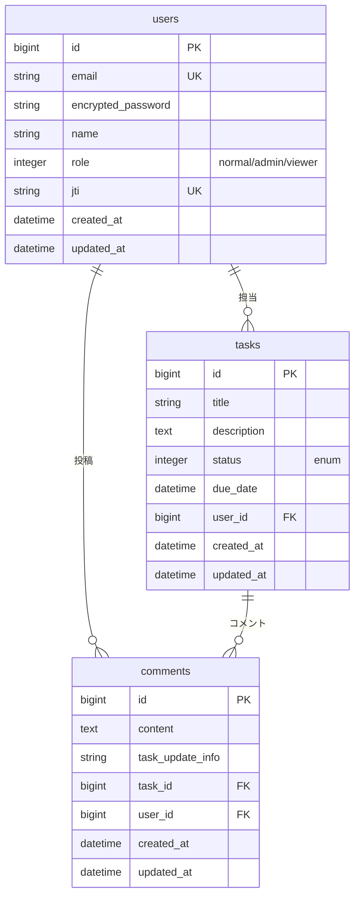

## ER図

```mermaid
erDiagram
  users ||--o{ tasks : "担当"
  users ||--o{ comments : "投稿"
  tasks ||--o{ comments : "コメント"

  users {
    bigint id PK
    string email UK
    string encrypted_password
    string name
    integer role "normal/admin/viewer"
    string jti UK
    datetime created_at
    datetime updated_at
  }

  tasks {
    bigint id PK
    string title
    text description
    integer status "enum"
    datetime due_date
    bigint user_id FK
    datetime created_at
    datetime updated_at
  }

  comments {
    bigint id PK
    text content
    string task_update_info
    bigint task_id FK
    bigint user_id FK
    datetime created_at
    datetime updated_at
  }
```
