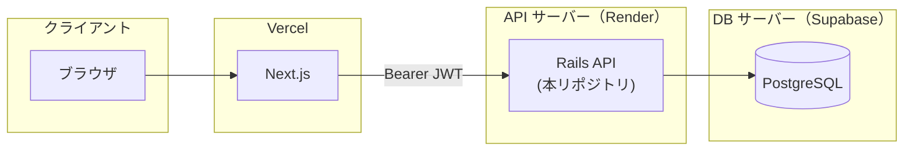

## インフラ構成

本番環境ではAPIサーバーとDBサーバーを分離して運用しています。

```mermaid
flowchart LR
  subgraph Client["クライアント"]
    Browser["ブラウザ"]
  end

  subgraph Frontend["Vercel"]
    Next["Next.js"]
  end

  subgraph APIServer["API サーバー（Render）"]
    Rails["Rails API\n(本リポジトリ)"]
  end

  subgraph DBServer["DB サーバー（Supabase）"]
    DB[(PostgreSQL)]
  end

  Browser --> Next
  Next -->|"Bearer JWT"| Rails
  Rails --> DB
```
