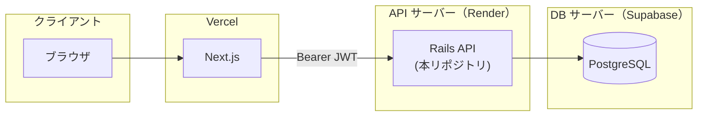
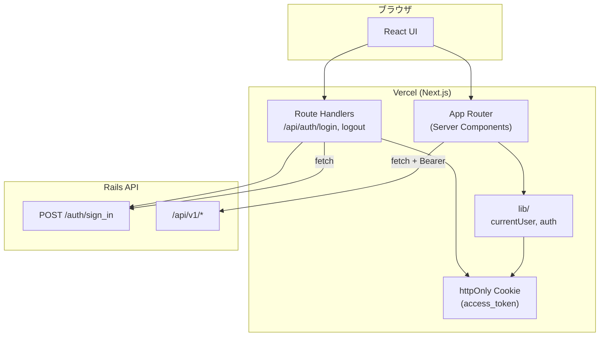

## インフラ構成

### デプロイ構成

本番環境では API サーバーと DB サーバーを分離して運用しています。

```mermaid
flowchart LR
  subgraph Client["クライアント"]
    Browser["ブラウザ"]
  end

  subgraph Frontend["Vercel"]
    Next["Next.js"]
  end

  subgraph APIServer["API サーバー（Render）"]
    Rails["Rails API\n(本リポジトリ)"]
  end

  subgraph DBServer["DB サーバー（Supabase）"]
    DB[(PostgreSQL)]
  end

  Browser --> Next
  Next -->|"Bearer JWT"| Rails
  Rails --> DB
```

### アプリケーション構成

Next.js（Vercel）内では、JWT を httpOnly Cookie で保持し、Server Component がサーバー側から Rails API を呼び出します。

```mermaid
flowchart TB
  subgraph Browser["ブラウザ"]
    UI["React UI"]
  end

  subgraph Vercel["Vercel (Next.js)"]
  direction TB
    Pages["App Router\n(Server Components)"]
    RouteHandlers["Route Handlers\n/api/auth/login, logout"]
    Cookie["httpOnly Cookie\n(access_token)"]
    Lib["lib/\ncurrentUser, auth"]
  end

  subgraph API["Rails API"]
    Auth["POST /auth/sign_in"]
    V1["/api/v1/*"]
  end

  UI --> Pages
  UI --> RouteHandlers
  RouteHandlers --> Auth
  RouteHandlers --> Cookie
  Pages --> Lib
  Lib --> Cookie
  Pages -->|"fetch + Bearer"| V1
  RouteHandlers -->|"fetch"| Auth
```
